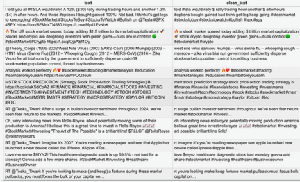
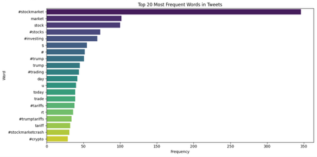
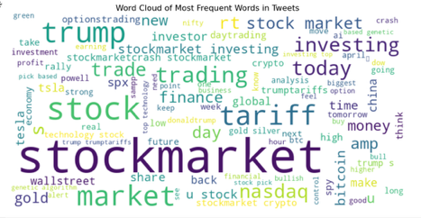
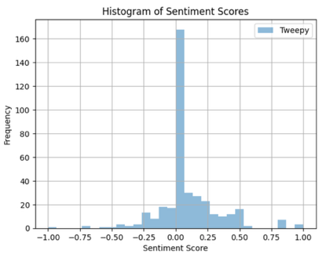
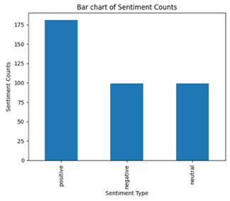
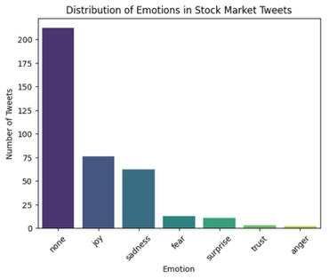
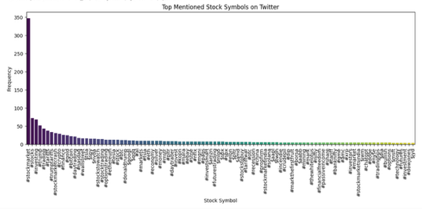
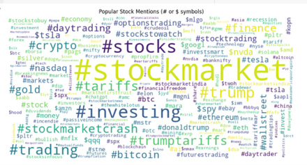

## Stock Market Analysis Using Twitter Data

### 🔍 Project Overview

This project aims to analyze Twitter conversations related to the stock market, particularly around major companies like Tesla, Apple, Amazon, Microsoft, and the SPY ETF. By performing sentiment analysis on relevant tweets, the project seeks to uncover patterns in public opinion that may reflect investor mood and market trends.

### 🔒 Credential Management

For this project, I am using a `creds.json` file to securely store my Twitter API bearer token. This approach keeps sensitive information out of the main code files, reducing the risk of accidental exposure.

I have added the `creds.json` file to my `.gitignore` to ensure it is not accidentally committed to my GitHub repository.

Example `creds.json` file:

    {
        "BEARER_TOKEN": "YOUR_BEARER_TOKEN_HERE"
    }

This file should be placed in the root directory of the project, alongside the Jupyter notebooks. This ensures the code can access the credentials without exposing them in the main scripts.

### 📥 Data Collection

Tweets were collected using the Twitter API by querying hashtags such as #StockMarket to capture discussions about the overall market and specific companies. This data includes tweet content, engagement metrics like retweets and likes, and timestamps to analyze temporal trends.

### 📄 Data Preprocessing

The collected tweets were merged into a unified dataset for easier analysis. 

**Key preprocessing steps included:**

- Removing duplicates to avoid repeated analysis of the same content.

- Cleaning text to remove unwanted characters, URLs, and special symbols, while retaining important markers like $ and # for stock symbols and hashtags.

- Tokenization and Lemmatization to break down sentences into meaningful words and reduce them to their root forms, enhancing the quality of text analysis.

### 🗃️ Sample Tweet Text (Before and After Cleaning)
During the data preprocessing stage, raw tweets were cleaned to remove unwanted characters, URLs, and special symbols, while preserving key financial symbols like $ (tickers) and # (hashtags). 

### 📊 Data Analysis and Visualization

**1. Frequent Word Analysis:** Extracted the most common words from the cleaned tweets to identify trending topics and popular stock symbols.

**2. Word Cloud Generation:** Created visual representations of the most frequently mentioned terms, providing insights into popular market discussions.

**3. Sentiment Analysis:** Used both TextBlob and VADER to classify tweets as positive, neutral, or negative based on the overall tone of the text.

**1. 📝 TextBlob Sentiment Analysis:**

Most tweets have a neutral tone, with sentiment scores clustered around 0, as shown in the histogram.

This method struggles with social media text, often missing slang, sarcasm, and context.

**2. 📝 VADER Sentiment Analysis:**

This provides a more accurate assessment for financial and market-related tweets. Also, it handles slang, abbreviations, and informal language better than TextBlob.

The bar chart reveals a more diverse emotional distribution, capturing more positive and negative tweets.

**4. Emotion Analysis:** Analyzed the emotional tone of tweets using a custom lexicon, categorizing tweets into emotions like joy, anger, sadness, fear, surprise, and trust.

**5. Stock Symbol Analysis:** Extracted and visualized the most mentioned stock symbols and hashtags, highlighting the most talked-about companies and market trends.

### 📈 Key Insights

- Most tweets were neutral, reflecting analytical or news-oriented content.

- Sentiment distribution indicated a mix of positive and negative market reactions, with significant emotional expressions around major financial events.

- Frequent mentions of terms like #StockMarket, $TSLA, $AAPL, #Investing, and #Crypto highlighted key market interests.

### 🤖 Synthetic Tweet Generation

In addition to real tweets, synthetic tweets were generated using the GPT-2 model to simulate realistic market discussions. These synthetic tweets were cleaned using the same text processing techniques to ensure consistency in analysis.

### 📂 Future Work

- Deep dive into synthetic tweets to uncover potential insights, as these tweets do not contain real-time, trending stock names and may offer a unique perspective on general market sentiment.

- Implement deeper sentiment analysis using machine learning models to capture context more accurately.

- Integrate real-time tweet analysis for live market sentiment tracking.

- Expand the lexicon for emotion analysis to improve accuracy in detecting complex emotions.

### 📋 Conclusion

This project demonstrates the potential of using Twitter data for stock market sentiment analysis, providing a foundation for further exploration into real-time financial market insights.

### 📧 Contact

For any questions or collaboration, please reach out at [nayaksimran5@gmail.com].

